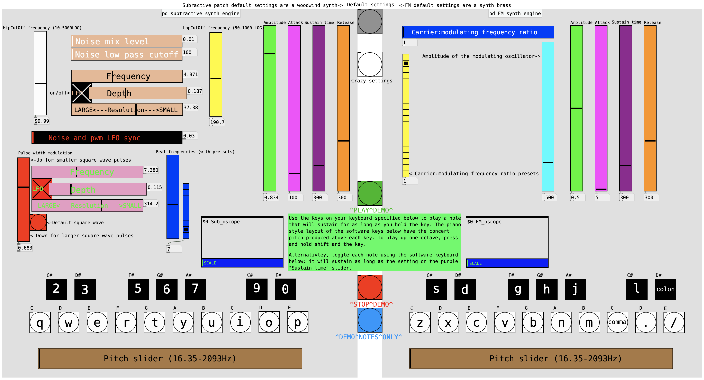

# FMandSubtractiveSynthEngine
## An interactive synthesiser coded using Purr data visual programming language for realtime DSP synthesis

This digital synthesiser uses Frequency Modulation synthesis, Subtractive synthesis, and low frequency oscillator effects alongside a colourful, neat, and intuitive user interface.

[Please see this short report to put the synthesiser design in context and provide more information on the design process](Audio%20tech%20assignment%20writeup%20Aidan%20Bennett.pdf)

